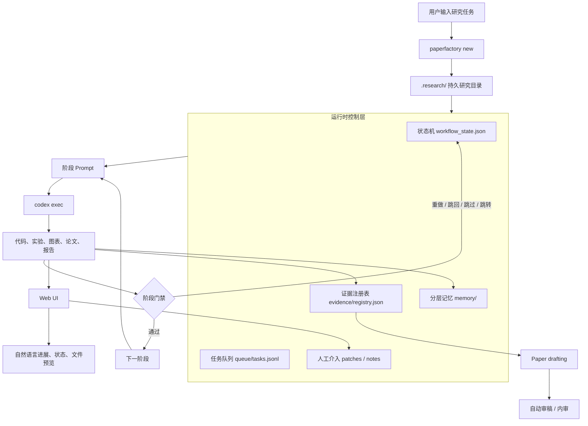
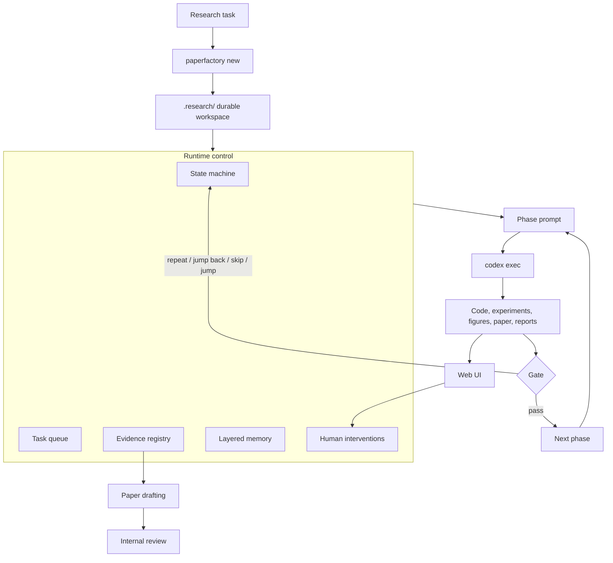

# Codex PaperFactory

**语言 / Language:** [中文](#中文) | [English](#english)

---

## 中文

Codex PaperFactory 是一个面向 Codex 的长期科研自动化插件和本地控制系统。它把一个初始研究任务拆成可恢复、可审计、可人工介入的科研流程：调研、baseline 代码探查、方法设计、实验、证据整理、论文写作和顶会审稿式内审。

它不是一次性 Prompt 模板。每一轮都会把状态、报告、证据、记忆、队列、日志和论文产物写入 `.research/`，浏览器关闭后也能通过后台进程继续跑，重新打开 UI 后可以继续观察和介入。

### 主图



### 一页理解

| 模块 | 说明 |
| --- | --- |
| 长期运行 | `.research/` 保存状态、报告、日志、阶段页面、队列和证据，方便中断后恢复。 |
| Web UI | 默认中文，支持启动/暂停、运行状态、Codex 状态、自然语言进展、文件树、阶段页、记忆模式和人工介入。 |
| 状态机工作流 | 基础阶段锁定，用户可以插入自定义阶段；阶段可自检后选择前进、重做、跳回、跳过或跳转。 |
| Baseline 策略 | baseline 先做代码探查和最小协议验证，不再假设必须 cheap；方法有可信信号后再复现关键强 baseline。 |
| LLM/RL 工具链 | 用 Open-LLM 做资源地图，优先选择 TRL、verl、ms-swift、LLaMA-Factory、OpenRLHF 等成熟框架，避免重复造轮子。 |
| 证据流 | `evidence/registry.json` 记录 claim、支撑产物、实验命令、指标来源、图表来源、置信度和是否 paper-safe。 |
| 论文写作 | 只从已有证据写作，集成会议论文写作、页数预算、LaTeX/Typst 检查、科研绘图、Draw.io 图表和自动审稿。 |

### 快速开始

#### 1. 克隆并检查

```bash
git clone git@github.com:happystander/codex-PaperFactory.git
cd codex-PaperFactory

./paperfactory --help
./paperfactory doctor
```

如果没有 SSH 权限，也可以用 HTTPS：

```bash
git clone https://github.com/happystander/codex-PaperFactory.git
```

#### 2. 可选：加入 PATH

```bash
ln -s "$(pwd)/paperfactory" ~/.local/bin/paperfactory
paperfactory --help
```

#### 3. 在研究工作目录创建任务

建议在你真正放实验代码和论文产物的工作目录执行：

```bash
/path/to/codex-PaperFactory/paperfactory new \
  --task "Develop a publishable method for multimodal generative recommendation"

/path/to/codex-PaperFactory/paperfactory web --open
```

远程服务器上常用：

```bash
/path/to/codex-PaperFactory/paperfactory web \
  --host 0.0.0.0 \
  --port 8765
```

如果端口不能直接访问，用 SSH 转发：

```bash
ssh -L 8765:127.0.0.1:8765 user@server
```

### 依赖

| 依赖 | 是否必需 | 用途 | 检查 / 安装 |
| --- | --- | --- | --- |
| Python 3.10+ | 必需 | CLI、控制器、Web UI、测试。 | `python3 --version` |
| Git | 必需 | 克隆和版本管理。 | `git --version` |
| Codex CLI | 自动运行必需 | 执行 `codex exec --full-auto`。 | `codex --version` |
| 浏览器 | 推荐 | 打开 Web UI。 | 任意现代浏览器 |
| Node.js | 推荐 | Draw.io 学术图表 skill CLI。 | `node --version` |
| LaTeX 工具链 | 可选 | 编译生成的 LaTeX 论文。 | `latexmk --version` |
| matplotlib | 可选 | `paperfactory plot` 绘图。 | `python3 -m pip install matplotlib` |
| 文献/PDF 工具 | 推荐 | ScholarAIO workspace、arXiv/Crossref/Semantic Scholar、PDF/Office 解析。 | `./paperfactory doctor` |
| 科学运行时工具 | 按任务需要 | GROMACS、LAMMPS、OpenFOAM、Quantum ESPRESSO、生信 CLI 等官方文档优先运行。 | `./paperfactory doctor` |
| NVIDIA 工具 | GPU 任务需要 | Web UI 显示 GPU 显存、利用率、温度、进程数和推荐空闲卡；Codex prompt 会读取同一状态。 | `nvidia-smi` |
| 写作/绘图 skills | 推荐 | 论文写作、结果回填、节奏润色、Draw.io 图表。 | `./paperfactory doctor` |

`doctor` 把核心问题显示为 `ERROR`，把可选能力缺失显示为 `WARN`。缺少可选工具时主流程仍能跑，但文献解析、实验可复现性、绘图和论文构建能力会变弱。

PaperFactory 会自动探测可用 Python 运行时，优先使用 `PAPERFACTORY_PYTHON`、`PYTHON_BIN` 或已知 Conda 环境中包含 `torch/transformers/datasets` 的解释器。后台 Codex 默认使用 host-access 模式，避免本机 GPU、localhost 代理和数据下载被 Codex sandbox 隔离；如需回到 Codex 默认隔离模式，可运行 `paperfactory run --codex-sandboxed ...`。

可选工具不要直接装进 PaperFactory 主 Python。使用隔离工具环境：

```bash
./paperfactory tools list
./paperfactory tools install literature pandoc
```

默认安装到 `~/.local/share/paperfactory/tools/<name>`，命令包装器放在 `~/.local/bin`。目前默认只管理轻量通用工具：文献检索/元数据、PDF/Office 解析、Pandoc 转换；实验追踪、主题聚类和 LLM/RL 训练框架按具体任务手动处理。

### 运行方式

| 方式 | 命令 / 操作 | 适用场景 |
| --- | --- | --- |
| Web UI 后台运行 | 在 Web UI 点击启动 | 推荐。关闭浏览器后 detached 进程继续运行，日志写入 `.research/logs/`。 |
| 单轮运行 | `paperfactory run --once` | 手动推进一轮 Codex。 |
| 多天运行 | `paperfactory run --until "2026-05-15 10:00:00" --interval 1800` | 终端前台运行，适合配合 `tmux`/`screen`。 |
| 后台终端运行 | `paperfactory run ... > .research/logs/paperfactory-run.out 2>&1 &` | 不用 Web UI 时保存输出。 |
| 演练 | `paperfactory run --once --dry-run` 或 UI 勾选 Dry run | 只刷新 Prompt，不调用 Codex。 |
| 手动 Prompt | `paperfactory prompt --copy` | 需要把下一轮 Prompt 手动交给 Codex 时。 |

终端进程如果断开，取决于你是否使用 `tmux`、`screen`、`nohup` 或后台重定向。Web UI 的启动按钮会创建 detached 后台进程，浏览器关闭不等于任务停止。

Web UI 的项目选择区支持新建、切换和删除项目。删除只允许作用于当前工作区内且已经暂停的研究项目，避免误删仍在运行的后台任务。

### 固定主干工作流

基础阶段锁定，用户只能插入额外自定义阶段，不能删除、重排或削弱基础门禁。

| # | 阶段 | 目标 | 关键产物 |
| --- | --- | --- | --- |
| 1 | `scope` | 明确研究问题、排除范围、目标会议/领域、数据集、指标、算力、风险和成功标准。 | `reports/scope.json` |
| 2 | `survey` | 文献优先级评分、claim extraction、代码接口图、baseline matrix、LLM/RL 工具候选和 novelty gap。 | `reports/survey.json` |
| 3 | `data_sanity` | 检查数据、切分、标签、泄漏风险、评测协议和 benchmark profile。 | `reports/data_sanity.json` |
| 4 | `cheap_baselines` | Baseline 代码探查：检查参考实现、入口、配置、GPU 需求和最小协议验证。内部 key 保留兼容，不代表只能跑 cheap baseline。 | `reports/cheap_baselines.json` |
| 5 | `method_design` | 最近 prior work 差异表、候选方法生成、critic 淘汰、novelty risk gate、原子概念和实现计划。 | `reports/method_design.json` |
| 6 | `method_smoke` | 跑最小方法路径，和 baseline 探查指标或参考指标做诊断比较，不宣称最终公平。 | `reports/method_smoke.json` |
| 7 | `advanced_comparison` | 方法出现可信信号后，选择关键强 baseline，用官方 checkpoint、官方评测或必要复现做公平比较。 | `reports/advanced_comparison.json` |
| 8 | `paper_evidence` | 整理主结果、消融、鲁棒性、失败边界、图表、Draw.io bundle 和 source-data manifest。 | `reports/paper_evidence.json` |
| 9 | `paper_drafting` | 只基于已登记证据写 Markdown/LaTeX/BibTeX 论文和 appendix。 | `reports/paper_drafting.json` |
| 10 | `internal_review` | 自动扮演顶会审稿人，检查创新性、证据、公平性、复现性、LaTeX QA 和格式自查。 | `reports/internal_review.json` |

### Baseline 策略

PaperFactory 现在不把 baseline 默认等同于 cheap baseline。推荐顺序是：

1. `survey`: 找到最近 prior work、官方代码、checkpoint、数据协议和评测命令。
2. `cheap_baselines`: 作为 legacy key 的 baseline code probe，先理解代码结构并跑最小验证，记录诊断指标或论文/官方指标。
3. `method_design`: 根据 baseline 接口和指标设计方法，避免只做调参或浅组合。
4. `method_smoke`: 先跑方法的最小路径，确认是否有可信信号。
5. `advanced_comparison`: 再复现或评估关键强 baseline，形成最终公平比较。

禁止把需要 GPU 训练的强 baseline 简化成 CPU 弱替代后当成公平结果。可以作为 diagnostic，但必须标注。

### LLM/RL 工具链

新增 `llm-rl-toolkit` skill。涉及 LLM、Agent、RAG、SFT、LoRA、DPO、PPO、GRPO、RLHF/RLVR、reward model 或 reasoning model 时，Codex 会先做工具选型，再写代码。

| 场景 | 优先框架 |
| --- | --- |
| Hugging Face 原生 SFT/DPO/GRPO/RLOO/reward model 原型 | TRL |
| 大规模 RL post-training、PPO/GRPO/DAPO、FSDP/Megatron、vLLM/SGLang rollout | verl |
| ModelScope/Qwen/多模态全流程训练、评测、量化和部署 | ms-swift |
| 快速 GUI/CLI 微调、LlamaBoard、广模型模板 | LLaMA-Factory |
| Ray + vLLM RLHF 调度、Agentic RL 脚本 | OpenRLHF |
| Agent/RAG 应用 | LangGraph、LlamaIndex、Haystack、RAGFlow、Mem0、DSPy 等 |

工具选型会写入 `.research/llm_tooling/tool_decision.md`，说明任务类型、候选框架、选择原因、本地检查、复用计划和失败 fallback。

### Web UI 能看到什么

```bash
paperfactory web --open
```

| 面板 | 用途 |
| --- | --- |
| 运行状态 | 显示 running/idle、PID、最后活动时间、当前阶段和 report 状态。 |
| Codex 状态 | 尝试读取 Codex session 里的 quota、上下文窗口、token 使用和重置时间。 |
| 自然语言进展 | 展示 Codex 自己写入的 `.research/progress/feed.jsonl`，不是简单日志切割。 |
| 工作流 | 查看基础阶段、插入自定义阶段、打开阶段展示页。 |
| 文件树 | 预览 `.research/` 产物，文件夹和同级文件可折叠。 |
| 记忆 | 选择下一轮 Codex 读取多少自动记忆包和源产物。 |
| 人工介入 | 暂停后写入新要求，下一轮以结构化 intervention patch 生效。 |

### 自定义阶段与跳转

| 功能 | 说明 |
| --- | --- |
| 插入自定义阶段 | 在 Web UI 流程面板中添加名称、插入位置和 Prompt。 |
| 保存位置 | `.research/workflow.json` |
| 默认产物 | `.research/custom/<phase>.md` 和 `.research/reports/<phase>.json` |
| 路由决策 | 阶段报告可写 `advance`、`repeat`、`jump_back`、`skip_next`、`jump_to`。 |
| 阶段清理 | 每阶段删除明确无用的临时文件；不确定的文件归档到 `.research/archive/cleanup/<phase>/`。 |

### 常用命令

| 命令 | 用途 |
| --- | --- |
| `paperfactory new --task "..."` | 初始化研究项目。 |
| `paperfactory status --logs 8` | 查看阶段、门禁、缺失产物和最近日志。 |
| `paperfactory prompt --copy` | 生成下一轮 Codex Prompt。 |
| `paperfactory run --once` | 运行一轮 Codex。 |
| `paperfactory run --until "YYYY-MM-DD HH:MM:SS" --interval 1800` | 无人值守循环运行。 |
| `paperfactory advance` | 当前阶段产物和报告通过后才推进。 |
| `paperfactory memory` | 刷新 `.research/memory/` 阶段交接、索引、决策/风险记忆和 claim 线索。 |
| `paperfactory runtime` | 刷新状态机、证据注册表、任务队列、停止条件和记忆。 |
| `paperfactory evidence` | 刷新并查看 claim-to-evidence 注册表。 |
| `paperfactory queue` | 刷新并查看当前任务队列。 |
| `paperfactory control` | 查看停止条件和成功条件判断。 |
| `paperfactory intervention --message "..."` | 记录结构化人工介入补丁。 |
| `paperfactory validate` | 校验状态和阶段报告。 |
| `paperfactory web --open` | 启动交互式 Web UI。 |
| `paperfactory tools list/install` | 查看或安装隔离可选工具环境。 |
| `paperfactory doctor` | 检查本地依赖和可选 skills。 |
| `paperfactory fetch-refs -- --pdf-only` | 下载获奖论文参考到本地忽略缓存。 |

### 产物目录

```text
.research/
  state.json
  workflow_state.json
  workflow.json
  ui_config.json
  task.md
  human_interventions.md
  progress/feed.jsonl
  memory/
  evidence/registry.json
  queue/tasks.jsonl
  control/stop_conditions.json
  interventions/patches.jsonl
  logs/
  reports/
  pages/
  scope/
  literature/
  data/
  baselines/
  method/
  experiments/
  figures/
  paper/
  reviews/
  custom/
  archive/cleanup/
```

### 集成 Skills

| Skill | 作用 |
| --- | --- |
| `autonomous-research` | 长期科研流程和实验门禁。 |
| `research-library-workflow` | ScholarAIO 风格文献库、workspace、topic/citation graph、引用核查。 |
| `paper-reader` | 有来源锚点的论文笔记和 baseline 事实。 |
| `llm-rl-toolkit` | Open-LLM 资源导航和 LLM/RL 框架选型。 |
| `citation-workflow` | 引用搜索、claim 支撑映射、BibTeX/LaTeX 片段。 |
| `scientific-figure` | 图表规划、source-data manifest、绘图 QA。 |
| `scientific-runtime-tooling` | 科学计算 CLI/仿真工具的官方文档优先、runtime provenance 和 smoke validation。 |
| `drawio-academic-skills` | 可编辑的方法图、流程图、架构图 bundle。 |
| `best-paper-writing-reference` | ICLR/NeurIPS/ICML/ACL/AAAI 获奖论文参考库。 |
| `conference-paper-writing` | 基于证据的会议论文写作。 |
| `conference-page-budget` | 8 页双栏、9 页单栏和 appendix 页数预算。 |
| `latex-typst-paper` | LaTeX/Typst 源文件检查。 |
| `paper-format-self-check` | KLC 风格最终源码/PDF 投稿格式自查。 |
| `manuscript-audit` | 顶会审稿式内部审查。 |
| `paper-from-zero`, `empirical-paper-writer`, `arxiv-paper-writer`, `results-backfill`, `latex-rhythm-refiner` | 来自 `latex-paper-skills` 的可选写作流程。 |

### 文档

| 文档 | 作用 |
| --- | --- |
| [`docs/usage.zh.md`](docs/usage.zh.md) | 中文使用说明。 |
| [`docs/local-ui.md`](docs/local-ui.md) | Web UI 和本地 dashboard 细节。 |
| [`docs/artifact-contract.md`](docs/artifact-contract.md) | 阶段报告和产物契约。 |
| [`docs/ai-researcher-adaptation.md`](docs/ai-researcher-adaptation.md) | AI-Researcher 工作流吸收说明。 |
| [`docs/latex-paper-skills-adaptation.md`](docs/latex-paper-skills-adaptation.md) | LaTeX 写作 skills 集成。 |
| [`docs/drawio-figure-integration.md`](docs/drawio-figure-integration.md) | Draw.io 图表 bundle 集成。 |
| [`docs/open-research-tooling.md`](docs/open-research-tooling.md) | ScholarAIO 文献库、PDF/Office 解析、科学运行时、实验追踪、工作流复现和论文构建工具。 |
| [`docs/refactor-roadmap.md`](docs/refactor-roadmap.md) | 工程化重构路线。 |

### 常见问题

| 问题 | 处理 |
| --- | --- |
| Web UI 打不开 | 确认 `paperfactory web --host 0.0.0.0 --port 8765` 正在运行，检查防火墙或 SSH 转发。 |
| Codex 看起来卡住 | 看 Web UI 的 PID、最后活动、Codex 状态、`.research/progress/feed.jsonl` 和 `.research/logs/`。 |
| 关闭浏览器后是否继续跑 | Web UI 启动的 detached 任务会继续跑；终端前台进程则需要 `tmux`、`screen` 或后台重定向。 |
| 需要中途介入 | 暂停当前运行，写入介入，再启动；否则介入会在下一轮生效。 |
| 阶段不能推进 | 运行 `paperfactory status`，通常是缺产物或 report status 不是 `complete`。 |
| 可选 skill 缺失 | 运行 `paperfactory doctor`，按提示安装后再检查。 |

### 安全规则

- 不编造引用、指标、图表或实验结果。
- proxy、smoke、diagnostic comparison 必须明确标注。
- `paper_evidence` 通过前不要开始正式论文写作。
- 每个论文图都需要 source data、脚本、caption 逻辑和 manifest。
- 每个结构图都应保留可编辑 Draw.io 源文件。
- 每个主要 claim 都应能映射到证据。
- 清理时不能删除原始输出、source data、配置、日志、引用或复现实验所需文件；不确定的文件应归档。

### 致谢

本插件继承并改造了以下项目的工作流结构：

| 字段 | 内容 |
| --- | --- |
| 作者 | Z-M-Huang |
| 项目 | Claude Codex |
| 仓库 | https://github.com/Z-M-Huang/claude-codex |

上游仓库许可证包含 GPL-3.0 条款和署名要求。

---

## English

Codex PaperFactory is a Codex plugin and local control system for long-horizon research automation. It turns one research task into a recoverable and auditable workflow for survey, baseline code probing, method design, experiments, evidence assembly, paper writing, and top-conference-style internal review.

It is not a one-shot prompt template. Each cycle writes durable state, reports, evidence, memory, task queue, logs, and paper artifacts under `.research/`. A Web UI run can continue after the browser is closed, and the UI can be reopened to inspect progress or intervene.

### Main Diagram



### What You Get

| Area | What PaperFactory Provides |
| --- | --- |
| Long-running research | Recoverable `.research/` state, phase reports, logs, pages, queue, and evidence. |
| Web UI | Chinese by default, with start/pause, run status, Codex status, natural-language progress, file tree, phase pages, memory mode, and human intervention. |
| State-machine workflow | Locked base phases plus user-inserted custom phases; phases may advance, repeat, jump back, skip, or jump. |
| Baseline policy | Baselines start as code probes and minimal protocol checks; full strong-baseline reproduction happens after the method shows signal. |
| LLM/RL tooling | Open-LLM resource routing plus TRL, verl, ms-swift, LLaMA-Factory, and OpenRLHF selection before custom trainers. |
| Evidence flow | `evidence/registry.json` tracks claims, artifacts, commands, metrics, figures/tables, confidence, and paper-safety. |
| Paper writing | Evidence-grounded drafting with conference writing, page budget, LaTeX/Typst checks, scientific figures, Draw.io diagrams, and internal review. |

### Quick Start

```bash
git clone git@github.com:happystander/codex-PaperFactory.git
cd codex-PaperFactory

./paperfactory --help
./paperfactory doctor
```

From your actual research workspace:

```bash
/path/to/codex-PaperFactory/paperfactory new \
  --task "Develop a publishable method for multimodal generative recommendation"

/path/to/codex-PaperFactory/paperfactory web --open
```

On a remote server:

```bash
/path/to/codex-PaperFactory/paperfactory web --host 0.0.0.0 --port 8765
ssh -L 8765:127.0.0.1:8765 user@server
```

Optional PATH shortcut:

```bash
ln -s "$(pwd)/paperfactory" ~/.local/bin/paperfactory
```

### Requirements

| Dependency | Required | Used For | Check / Install |
| --- | --- | --- | --- |
| Python 3.10+ | Yes | CLI, controller, Web UI, tests. | `python3 --version` |
| Git | Yes | Clone and version control. | `git --version` |
| Codex CLI | Yes for autonomous runs | Executes `codex exec --full-auto`. | `codex --version` |
| Browser | Recommended | Web UI. | Any modern browser |
| Node.js | Recommended | Draw.io academic diagram skill CLI. | `node --version` |
| LaTeX toolchain | Optional | Compile generated papers. | `latexmk --version` |
| matplotlib | Optional | `paperfactory plot`. | `python3 -m pip install matplotlib` |
| Literature/PDF tools | Recommended | ScholarAIO workspaces, literature APIs, PDF/Office extraction. | `./paperfactory doctor` |
| Scientific runtime tools | Task dependent | Official-doc-first GROMACS, LAMMPS, OpenFOAM, Quantum ESPRESSO, bioinformatics CLIs, and similar tools. | `./paperfactory doctor` |
| NVIDIA tools | Required for GPU work | Web UI shows GPU memory, utilization, temperature, process count, and recommended idle cards; Codex prompts read the same snapshot. | `nvidia-smi` |
| Writing/figure skills | Recommended | Paper writing, result backfill, prose refinement, Draw.io figures. | `./paperfactory doctor` |

PaperFactory auto-detects a useful Python runtime. It prefers `PAPERFACTORY_PYTHON`, `PYTHON_BIN`, or known Conda environments that provide `torch/transformers/datasets`. Background Codex runs use host-access mode by default so local GPUs, localhost proxies, and dataset downloads are not blocked by Codex sandbox isolation. Use `paperfactory run --codex-sandboxed ...` to opt back into the normal Codex sandbox.

Install optional tools into isolated environments instead of the PaperFactory controller Python:

```bash
./paperfactory tools list
./paperfactory tools install literature pandoc
```

Tool envs live under `~/.local/share/paperfactory/tools/<name>` by default, with command wrappers in `~/.local/bin`. The default managed set is intentionally lightweight: literature search/metadata, PDF/Office parsing, and Pandoc conversion. Experiment tracking, topic modeling, and LLM/RL training frameworks are handled per task instead of installed by default.

### Run Modes

| Mode | Command / Action | Notes |
| --- | --- | --- |
| Web UI background run | Click Start in the Web UI | Recommended. Detached process continues after the browser closes. |
| One cycle | `paperfactory run --once` | Runs one Codex cycle. |
| Multi-day terminal run | `paperfactory run --until "2026-05-15 10:00:00" --interval 1800` | Use with `tmux` or `screen`. |
| Background terminal run | `paperfactory run ... > .research/logs/paperfactory-run.out 2>&1 &` | Saves terminal output. |
| Dry run | `paperfactory run --once --dry-run` | Refreshes prompts without invoking Codex. |
| Manual prompt | `paperfactory prompt --copy` | Copies the next prompt for manual use. |

The Web UI project selector can create, switch, and delete projects. Delete is limited to paused projects inside the current workspace.

### Fixed Base Workflow

| # | Phase | Purpose | Report |
| --- | --- | --- | --- |
| 1 | `scope` | Define target, exclusions, venue/domain, data, metrics, compute, risks, and success criteria. | `reports/scope.json` |
| 2 | `survey` | Score papers, extract claims, map code interfaces, build baseline matrix, select LLM/RL tools when relevant, and define novelty gap. | `reports/survey.json` |
| 3 | `data_sanity` | Verify data, splits, leakage, metrics, and protocol. | `reports/data_sanity.json` |
| 4 | `cheap_baselines` | Baseline code probe. Inspect reference implementations, entry points, configs, GPU needs, and minimal protocol checks. Legacy key kept for compatibility. | `reports/cheap_baselines.json` |
| 5 | `method_design` | Nearest-prior diff, candidate ideas, critic pass, novelty-risk gate, atomic concepts, and implementation plan. | `reports/method_design.json` |
| 6 | `method_smoke` | Run the smallest method path and make diagnostic comparisons against probe/reference metrics. | `reports/method_smoke.json` |
| 7 | `advanced_comparison` | Reproduce or evaluate strong baselines fairly after the method shows credible signal. | `reports/advanced_comparison.json` |
| 8 | `paper_evidence` | Assemble results, ablations, robustness, failures, figures, diagrams, and source-data manifests. | `reports/paper_evidence.json` |
| 9 | `paper_drafting` | Draft Markdown/LaTeX/BibTeX paper and appendix from registered evidence only. | `reports/paper_drafting.json` |
| 10 | `internal_review` | Run top-conference-style review for novelty, evidence, fairness, reproducibility, LaTeX QA, and format hygiene. | `reports/internal_review.json` |

### Baseline Policy

Baselines are not assumed to be cheap. The intended order is:

1. Survey recent prior work, official code, checkpoints, data protocols, and evaluation commands.
2. Probe baseline code and run minimal checks to verify install, data format, evaluation protocol, and metric extraction.
3. Design the method using baseline interfaces and diagnostic/reference metrics.
4. Run a method smoke test.
5. Reproduce or evaluate key strong baselines during advanced comparison.

Do not replace a GPU-trained baseline with a weak CPU proxy as if it were a fair result. Such runs are allowed only as diagnostics and must be labeled.

### LLM/RL Tooling

The `llm-rl-toolkit` skill applies to LLM, Agent, RAG, SFT, LoRA, DPO, PPO, GRPO, RLHF/RLVR, reward-model, and reasoning-model work.

| Need | Prefer |
| --- | --- |
| Hugging Face-native SFT/DPO/GRPO/RLOO/reward-model prototypes | TRL |
| Large-scale RL post-training with FSDP/Megatron and vLLM/SGLang rollout | verl |
| ModelScope/Qwen/multimodal full-pipeline training, evaluation, quantization, deployment | ms-swift |
| Fast GUI/CLI fine-tuning and broad model templates | LLaMA-Factory |
| Ray + vLLM RLHF scheduling and agentic RL scripts | OpenRLHF |
| Agent/RAG applications | LangGraph, LlamaIndex, Haystack, RAGFlow, Mem0, DSPy |

The decision record lives at `.research/llm_tooling/tool_decision.md`.

### Web UI

```bash
paperfactory web --open
```

| Panel | Use |
| --- | --- |
| Run status | Running/idle state, PID, last activity, current phase, and report status. |
| Codex status | Quota, context window, token usage, and reset timing when available. |
| Progress chat | Codex-authored natural-language progress from `.research/progress/feed.jsonl`. |
| Workflow | Base phases, custom phases, and phase pages. |
| File tree | Preview `.research/` artifacts with collapsible folders. |
| Memory | Choose how much memory/source context the next Codex cycle reads. |
| Intervention | Add structured instructions for the next cycle. |

### Common Commands

| Command | Purpose |
| --- | --- |
| `paperfactory new --task "..."` | Initialize a research project. |
| `paperfactory status --logs 8` | Show phase, gate, missing artifacts, and recent logs. |
| `paperfactory prompt --copy` | Generate the next Codex prompt. |
| `paperfactory run --once` | Run one Codex cycle. |
| `paperfactory run --until "YYYY-MM-DD HH:MM:SS" --interval 1800` | Run unattended cycles. |
| `paperfactory advance` | Advance only when the current report and artifacts pass. |
| `paperfactory memory` | Refresh generated memory. |
| `paperfactory runtime` | Refresh workflow state, evidence, queue, control, and memory. |
| `paperfactory evidence` | Refresh and inspect claim-to-evidence registry. |
| `paperfactory queue` | Refresh and inspect active task queue. |
| `paperfactory control` | Inspect stop and success-condition decisions. |
| `paperfactory intervention --message "..."` | Record a structured intervention patch. |
| `paperfactory validate` | Validate state and phase reports. |
| `paperfactory web --open` | Start the Web UI. |
| `paperfactory tools list/install` | List or install isolated optional-tool environments. |
| `paperfactory doctor` | Check local dependencies and optional skills. |

### Artifacts

```text
.research/
  state.json
  workflow_state.json
  workflow.json
  ui_config.json
  progress/feed.jsonl
  memory/
  evidence/registry.json
  queue/tasks.jsonl
  control/stop_conditions.json
  interventions/patches.jsonl
  logs/
  reports/
  pages/
  scope/
  literature/
  data/
  baselines/
  method/
  experiments/
  figures/
  paper/
  reviews/
  custom/
  archive/cleanup/
```

### Integrated Skills

| Skill | Purpose |
| --- | --- |
| `autonomous-research` | Long-horizon research workflow and phase gates. |
| `research-library-workflow` | ScholarAIO-style paper library workspaces, topic/citation graph checks, ingestion, and citation validation. |
| `scientific-runtime-tooling` | Official-doc/toolref-first scientific CLI and simulation provenance, smoke validation, and parameter safety. |
| `llm-rl-toolkit` | Open-LLM resource routing and LLM/RL framework selection. |
| `scientific-figure`, `drawio-academic-skills` | Paper figures, source-data manifests, and editable architecture/workflow diagrams. |
| `conference-paper-writing`, `conference-page-budget`, `latex-typst-paper`, `paper-format-self-check` | Evidence-safe conference writing, page budgets, source checks, and final format QA. |
| `manuscript-audit` | Top-conference-style internal review. |

### Documentation

| Document | Purpose |
| --- | --- |
| [`docs/usage.zh.md`](docs/usage.zh.md) | Chinese usage guide. |
| [`docs/local-ui.md`](docs/local-ui.md) | Web UI and dashboard details. |
| [`docs/artifact-contract.md`](docs/artifact-contract.md) | Phase report and artifact contracts. |
| [`docs/ai-researcher-adaptation.md`](docs/ai-researcher-adaptation.md) | AI-Researcher-inspired workflow adaptation. |
| [`docs/open-research-tooling.md`](docs/open-research-tooling.md) | ScholarAIO-style libraries, PDF/Office parsing, scientific runtimes, and optional research tooling. |
| [`docs/refactor-roadmap.md`](docs/refactor-roadmap.md) | Engineering refactor roadmap. |

### Safety Rules

- Do not invent citations, metrics, figures, or experiment results.
- Mark proxy, smoke, and diagnostic comparisons explicitly.
- Do not draft the paper before evidence gates pass.
- Every figure needs source data, script, caption logic, and manifest entry.
- Every main claim should map to evidence.
- Cleanup must not delete raw outputs, source data, configs, logs, citations, or reproducibility files; archive uncertain files instead.

### Attribution

This plugin is derived from the workflow structure of:

| Field | Value |
| --- | --- |
| Author | Z-M-Huang |
| Project | Claude Codex |
| Repository | https://github.com/Z-M-Huang/claude-codex |

The upstream repository license includes GPL-3.0 terms with an attribution requirement.
