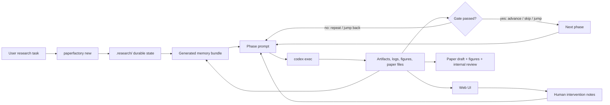
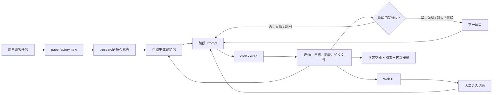

# Codex PaperFactory

**Language / 语言:** [English](#english) | [中文](#中文)

---

## English

Codex PaperFactory is a Codex plugin and local control system for long-horizon research automation. It turns one research task into an auditable workflow for literature survey, baselines, experiments, scientific figures, paper drafting, and internal review.

It is designed for multi-day work: every phase writes durable files under `.research/`, the controller advances only when gates pass, and the Web UI lets a human inspect progress or intervene without losing state.

### Main Diagram



### What You Get

| Area | What PaperFactory Provides |
| --- | --- |
| Long-running research | Recoverable `.research/` state, phase reports, audit logs, and resumable cycles. |
| Memory transfer | Generated `.research/memory/` handoff, artifact index, phase summaries, route decisions, risks, and claim/evidence notes. |
| Quality gates | Fixed base workflow with explicit required artifacts, reviewer gates, retry budgets, and stop/success conditions. |
| Runtime control | State-machine snapshot, task queue, evidence registry, intervention patches, and stop decisions under `.research/`. |
| Human control | Chinese-by-default Web UI with Chinese/English switching, start/pause, status, runtime control, file preview, memory mode, custom phases, and intervention notes. |
| Codex visibility | Codex-authored natural-language progress feed, Codex status, PID, last activity, and token/quota snapshot when available. |
| Research workflow | Scope, survey, data sanity, baselines, method design, smoke tests, advanced comparisons, evidence, drafting, review. |
| Writing and figures | Scientific plots, Draw.io editable diagram bundles, LaTeX/BibTeX drafting checkpoints, and top-conference-style internal review. |
| Customization | Base phases are locked; users can insert custom phases with their own prompts between base phases. |

### Requirements

| Dependency | Required | Used For | Install / Check |
| --- | --- | --- | --- |
| Python 3.10+ | Yes | CLI, controller, Web UI, tests. | `python3 --version` |
| Git | Yes | Clone and version control. | `git --version` |
| Codex CLI | Required for autonomous runs | Executes `codex exec --full-auto`. | `codex --version` |
| Browser | Recommended | Interactive Web UI. | Any modern browser |
| Node.js | Recommended | Draw.io academic diagram skill CLI. | `node --version` |
| matplotlib | Optional | `paperfactory plot` helper. | `python3 -m pip install matplotlib` |
| LaTeX toolchain | Optional | Compile generated LaTeX papers. | `latexmk --version` or equivalent |
| External writing skills | Recommended | `paper-from-zero`, empirical/review writers, result backfill, rhythm refinement. | `./paperfactory doctor` |
| Draw.io skill | Recommended | Editable `.drawio + .spec.yaml + .arch.json + .svg` figure bundles. | `./paperfactory doctor` |
| Open research tools | Recommended | Literature APIs, PDF extraction, experiment tracking, workflow replay, data/model versioning. | `./paperfactory doctor` and [`docs/open-research-tooling.md`](docs/open-research-tooling.md) |

Run the dependency check after cloning:

```bash
./paperfactory doctor
```

`doctor` treats core failures as errors and optional skill/tool gaps as warnings. Core research still works without optional plotting, LaTeX, Draw.io, PDF parsing, or experiment-tracking tools, but research quality and reproducibility are stronger when those are available.

### Install

#### 1. Clone

```bash
git clone git@github.com:happystander/codex-PaperFactory.git
cd codex-PaperFactory
```

HTTPS also works:

```bash
git clone https://github.com/happystander/codex-PaperFactory.git
cd codex-PaperFactory
```

#### 2. Check the launcher

```bash
./paperfactory --help
./paperfactory doctor
```

#### 3. Optional: add the launcher to PATH

```bash
ln -s "$(pwd)/paperfactory" ~/.local/bin/paperfactory
paperfactory --help
```

#### 4. Optional: register as a Codex plugin

The plugin manifest is:

```text
.codex-plugin/plugin.json
```

If your Codex setup uses a local marketplace file, copy the entry from:

```text
codex-marketplace-entry.json
```

or use:

```text
codex-marketplace.json
```

### Quick Start

From any target research workspace:

```bash
/path/to/codex-PaperFactory/paperfactory new \
  --task "Develop a publishable method for multimodal generative recommendation"

/path/to/codex-PaperFactory/paperfactory web --open
```

On a remote server, bind explicitly:

```bash
/path/to/codex-PaperFactory/paperfactory web \
  --host 0.0.0.0 \
  --port 8765
```

Then open the server URL, or use SSH port forwarding if the port is not exposed:

```bash
ssh -L 8765:127.0.0.1:8765 user@server
```

### Run Modes

| Mode | Command | Notes |
| --- | --- | --- |
| Create project | `paperfactory new --task "..."` | Creates `.research/`, `state.json`, prompt, and dashboard. |
| One cycle | `paperfactory run --once` | Generates a phase prompt and calls Codex once. |
| Multi-day run | `paperfactory run --until "2026-05-15 10:00:00" --interval 1800` | Runs one Codex cycle per interval until the target time. |
| Web UI background run | Use the Web UI Start button | Detached process keeps running after the browser closes. |
| Dry run | Web UI `Dry run`, or `paperfactory run --once --dry-run` | Refreshes prompts without invoking Codex. |
| Manual prompt | `paperfactory prompt --copy` | Use when you want to paste the next prompt manually. |

Terminal output for `paperfactory run` goes to the terminal unless you redirect it:

```bash
paperfactory run --until "2026-05-15 10:00:00" --interval 1800 \
  > .research/logs/paperfactory-run.out 2>&1 &
```

The Web UI writes run output under `.research/logs/`.

The Web UI also shows the runtime layer directly: current state-machine node, pending queue item, paper-safe claim count, stop decision, and pending intervention patches. These views are backed by `.research/workflow_state.json`, `.research/queue/tasks.jsonl`, `.research/evidence/registry.json`, `.research/control/stop_conditions.json`, and `.research/interventions/patches.jsonl`.

The language buttons default to Chinese. Switching to English updates the UI and writes `.research/ui_config.json`; the next generated Codex prompt then requires user-facing progress updates, phase pages, stage replies, and review summaries to use English. Switching back restores Simplified Chinese output for later cycles.

### Fixed Base Workflow

The base workflow is locked. Users can insert custom phases, but they cannot delete, reorder, or weaken the base quality gates.

| # | Phase | Purpose | Required Report |
| --- | --- | --- | --- |
| 1 | `scope` | Define target problem, exclusions, venue/domain, datasets, metrics, compute, risks, success criteria. | `reports/scope.json` |
| 2 | `survey` | Search primary sources, inspect recent papers/repos, build baseline matrix and novelty gap. | `reports/survey.json` |
| 3 | `data_sanity` | Verify dataset, splits, labels, leakage risk, metrics, protocol. | `reports/data_sanity.json` |
| 4 | `cheap_baselines` | Run simple strong baselines before method work. | `reports/cheap_baselines.json` |
| 5 | `method_design` | Design the method from the gap, atomic concepts, ablations, and implementation plan. | `reports/method_design.json` |
| 6 | `method_smoke` | Run the smallest self-contained method path and compare with cheap baselines. | `reports/method_smoke.json` |
| 7 | `advanced_comparison` | Compare fairly against strong baselines, released checkpoints, or justified reproductions. | `reports/advanced_comparison.json` |
| 8 | `paper_evidence` | Assemble results, ablations, failure cases, analysis, figures, Draw.io bundles. | `reports/paper_evidence.json` |
| 9 | `paper_drafting` | Draft Markdown/LaTeX/BibTeX paper only from supported evidence. | `reports/paper_drafting.json` |
| 10 | `internal_review` | Act as a top-conference reviewer and audit novelty, evidence, fairness, reproducibility, LaTeX QA, and final format hygiene. | `reports/internal_review.json` |

### Custom Phases and Routing

| Feature | How It Works |
| --- | --- |
| Insert custom phase | Use the Web UI workflow panel. Each custom phase has a title, insertion point, and prompt. |
| Stored in | `.research/workflow.json` |
| Default artifacts | `.research/custom/<phase>.md` and `.research/reports/<phase>.json` |
| Phase cleanup | Each phase should remove obvious temporary files and archive uncertain files under `.research/archive/cleanup/<phase>/`. |
| Base phases | Always kept and locked. |
| Human intervention | Saved to `.research/human_interventions.md` and injected into the next prompt. |

Each phase report may include a route decision:

```json
{
  "phase": "method_smoke",
  "status": "complete",
  "route": {
    "decision": "advance",
    "target_phase": "",
    "reason": "The smoke test produced a valid signal and required artifacts exist.",
    "confidence": 0.82
  }
}
```

| Decision | Effect |
| --- | --- |
| `advance` | Move to the next configured phase. |
| `repeat` | Keep the current phase active for another attempt. |
| `jump_back` | Return to a valid earlier phase named by `target_phase`. |
| `skip_next` | Skip only the immediately following phase. |
| `jump_to` | Jump to a valid configured phase or `complete`. |

### Web UI

```bash
paperfactory web --open
```

| Panel | Use |
| --- | --- |
| Run status | Shows running/idle state, PID, last activity, active phase, and report status. |
| Codex status | Reads recent Codex session files for quota, context window, token usage, and reset timing when available. |
| File tree | Opens `.research/` artifacts in full-page preview. |
| Workflow | Shows base phases, lets users insert custom phases, and opens phase pages. |
| Progress chat | Displays Codex-authored natural-language updates from `.research/progress/feed.jsonl`. |
| Intervention box | Adds user instructions for the next cycle. |
| Memory | Chooses how much of the generated memory bundle and source artifacts the next Codex cycle reads. |

### Command Reference

| Command | Purpose |
| --- | --- |
| `paperfactory new --task "..."` | Initialize a research project. |
| `paperfactory status --logs 8` | Show phase, gate, missing artifacts, and recent logs. |
| `paperfactory prompt --copy` | Generate the next Codex prompt. |
| `paperfactory run --once` | Run one Codex cycle. |
| `paperfactory run --until "YYYY-MM-DD HH:MM:SS" --interval 1800` | Run unattended cycles. |
| `paperfactory advance` | Advance only if current phase artifacts and report pass. |
| `paperfactory memory` | Refresh `.research/memory/` handoff, indexes, decision/risk memory, and claim notes. |
| `paperfactory runtime` | Refresh workflow state, evidence registry, queue, stop conditions, and memory together. |
| `paperfactory evidence` | Refresh and inspect claim-to-evidence registry. |
| `paperfactory queue` | Refresh and inspect the active task queue. |
| `paperfactory control` | Inspect stop and success-condition decisions. |
| `paperfactory intervention --message "..."` | Record a structured human intervention patch. |
| `paperfactory validate` | Validate state and phase reports. |
| `paperfactory web --open` | Start the interactive Web UI. |
| `paperfactory dashboard --open` | Generate static HTML dashboard. |
| `paperfactory doctor` | Check local dependencies and optional skills. |
| `paperfactory bib -- ...` | Search local BibTeX/Zotero-exported references. |
| `paperfactory check -- paper/paper_draft.md --format markdown` | Run manuscript hygiene checks. |
| `paperfactory plot -- ...` | Generate paper-style metric plots. |
| `paperfactory fetch-refs -- --pdf-only` | Download curated award-paper references into the ignored local cache. |

### Artifact Layout

```text
.research/
  state.json
  workflow_state.json
  workflow.json
  ui_config.json
  task.md
  human_interventions.md
  progress/feed.jsonl
  memory/
  evidence/registry.json
  queue/tasks.jsonl
  control/stop_conditions.json
  interventions/patches.jsonl
  logs/
  reports/
  pages/
  scope/
  literature/
  data/
  baselines/
  method/
  experiments/
  figures/
  paper/
  reviews/
  custom/
  archive/cleanup/
```

### Skills

| Skill | Role |
| --- | --- |
| `autonomous-research` | Long-horizon research process and experiment gates. |
| `paper-reader` | Source-grounded paper notes and baseline facts. |
| `citation-workflow` | Citation search, support mapping, BibTeX/LaTeX snippets. |
| `scientific-figure` | Figure planning, source-data manifests, plot QA. |
| `drawio-academic-skills` | Editable method/workflow/architecture diagram bundles. |
| `best-paper-writing-reference` | Curated ICLR/NeurIPS/ICML/ACL/AAAI award-paper references for experiment and writing patterns. |
| `conference-paper-writing` | Evidence-grounded conference paper drafting. |
| `conference-page-budget` | 8-page double-column, 9-page single-column, and appendix page-budget planning. |
| `latex-typst-paper` | Manuscript source checks. |
| `paper-format-self-check` | KLC-style final source/PDF submission hygiene. |
| `manuscript-audit` | Top-conference-style internal review. |
| `paper-from-zero`, `empirical-paper-writer`, `arxiv-paper-writer`, `results-backfill`, `latex-rhythm-refiner` | Optional external writing workflow from `latex-paper-skills`. |

### Troubleshooting

| Symptom | Check |
| --- | --- |
| Web UI does not open | Confirm `paperfactory web --host 0.0.0.0 --port 8765` is running, then check firewall or use SSH port forwarding. |
| Codex seems stuck | Open Web UI status, check PID, last activity, `.research/progress/feed.jsonl`, and `.research/logs/`. |
| Browser closed | A detached Web UI run continues; check `paperfactory status` or reopen the UI. |
| Need immediate intervention | Pause the active run, send intervention, then restart. Otherwise the note applies next cycle. |
| Phase will not advance | Run `paperfactory status`; missing artifacts or non-complete report status block advancement. |
| Optional skills missing | Run `paperfactory doctor`; install missing skills/tools, then rerun doctor. |

### Documentation

| Document | Purpose |
| --- | --- |
| [`docs/usage.zh.md`](docs/usage.zh.md) | Chinese usage notes. |
| [`docs/local-ui.md`](docs/local-ui.md) | Web UI and local dashboard details. |
| [`docs/artifact-contract.md`](docs/artifact-contract.md) | Phase report and artifact contract. |
| [`docs/ai-researcher-adaptation.md`](docs/ai-researcher-adaptation.md) | AI-Researcher-inspired workflow adaptation. |
| [`docs/latex-paper-skills-adaptation.md`](docs/latex-paper-skills-adaptation.md) | LaTeX writing skill integration. |
| [`docs/drawio-figure-integration.md`](docs/drawio-figure-integration.md) | Draw.io figure bundle integration. |
| [`docs/open-research-tooling.md`](docs/open-research-tooling.md) | Optional open-source research tools for discovery, PDF parsing, experiments, workflows, and paper builds. |
| [`docs/refactor-roadmap.md`](docs/refactor-roadmap.md) | Engineering refactor plan for splitting large scripts into core modules. |

### Safety Rules

- Do not invent citations, metrics, figures, or experiment results.
- Mark proxy, smoke, and diagnostic comparisons explicitly.
- Do not draft a paper before evidence gates pass.
- Every paper figure needs source data, script, caption logic, and manifest entry.
- Every structural diagram should preserve editable Draw.io sources.
- Every main claim should map to evidence.
- Cleanup must not delete raw outputs, source data, configs, logs, citations, or files needed to reproduce a result; archive uncertain files instead.

### Attribution

This plugin is derived from the workflow structure of:

| Field | Value |
| --- | --- |
| Author | Z-M-Huang |
| Project | Claude Codex |
| Repository | https://github.com/Z-M-Huang/claude-codex |

The upstream repository license includes GPL-3.0 terms with an attribution requirement.

---

## 中文

Codex PaperFactory 是一个面向 Codex 的长期科研自动化插件和本地控制系统。它把一个初始研究任务拆成可审计的长期流程：文献调研、基线、实验、科研图表、论文写作和内部审稿。

它不是一次性聊天模板，而是一个可以跑几天的研究工作台：所有状态都写入 `.research/`，每个阶段都有门禁，Web UI 可以实时查看、暂停、继续和人工介入。

### 主图



### 它能做什么

| 模块 | 说明 |
| --- | --- |
| 长期运行 | 用 `.research/` 保存状态、阶段报告、审计日志和可恢复循环。 |
| 记忆传输 | 自动生成 `.research/memory/`：阶段交接、产物索引、阶段摘要、跳转决策、风险和 claim/evidence 线索。 |
| 质量门禁 | 固定主干工作流，每阶段必须产生必要产物，并结合审稿门禁、重试预算和停止/成功条件。 |
| 运行时控制 | `.research/` 下持久化状态机快照、任务队列、证据注册表、介入补丁和停止判定。 |
| 人工控制 | Web UI 默认中文，支持中英文切换、启动/暂停、状态查看、运行时控制、文件预览、记忆模式、自定义阶段和人工介入。 |
| Codex 可视化 | 展示 Codex 自己写入的自然语言进展、运行 PID、最后活动、Codex 状态和余量。 |
| 科研流程 | 范围定义、综述、数据检查、基线、方法设计、烟测、高级比较、证据整理、写作、内审。 |
| 写作与图表 | 科研绘图、Draw.io 可编辑图表 bundle、LaTeX/BibTeX 写作检查点、顶会审稿式内审。 |
| 自定义 | 基础阶段锁定；用户可以在基础阶段之间插入带 Prompt 的自定义阶段。 |

### 依赖

| 依赖 | 是否必需 | 用途 | 安装 / 检查 |
| --- | --- | --- | --- |
| Python 3.10+ | 必需 | CLI、控制器、Web UI、测试。 | `python3 --version` |
| Git | 必需 | 克隆和版本管理。 | `git --version` |
| Codex CLI | 自动运行必需 | 执行 `codex exec --full-auto`。 | `codex --version` |
| 浏览器 | 推荐 | 打开交互式 Web UI。 | 任意现代浏览器 |
| Node.js | 推荐 | Draw.io 学术图表 skill CLI。 | `node --version` |
| matplotlib | 可选 | `paperfactory plot` 绘图工具。 | `python3 -m pip install matplotlib` |
| LaTeX 工具链 | 可选 | 编译生成的 LaTeX 论文。 | `latexmk --version` 或等价工具 |
| 外部写作 skills | 推荐 | 综述/实证论文写作、结果回填、文本节奏润色。 | `./paperfactory doctor` |
| Draw.io skill | 推荐 | 生成 `.drawio + .spec.yaml + .arch.json + .svg` 可编辑图表 bundle。 | `./paperfactory doctor` |
| 开源科研工具 | 推荐 | 文献 API、PDF 解析、实验追踪、工作流复现、数据/模型版本管理。 | `./paperfactory doctor` 和 [`docs/open-research-tooling.md`](docs/open-research-tooling.md) |

克隆后先运行：

```bash
./paperfactory doctor
```

`doctor` 会检查核心依赖和可选能力。缺少可选绘图、LaTeX、Draw.io、PDF 解析或实验追踪工具时，核心研究流程仍可运行，但研究质量和可复现性会变弱。

### 安装

#### 1. 克隆仓库

```bash
git clone git@github.com:happystander/codex-PaperFactory.git
cd codex-PaperFactory
```

也可以使用 HTTPS：

```bash
git clone https://github.com/happystander/codex-PaperFactory.git
cd codex-PaperFactory
```

#### 2. 检查启动器

```bash
./paperfactory --help
./paperfactory doctor
```

#### 3. 可选：加入 PATH

```bash
ln -s "$(pwd)/paperfactory" ~/.local/bin/paperfactory
paperfactory --help
```

#### 4. 可选：注册为 Codex 插件

插件 manifest 位于：

```text
.codex-plugin/plugin.json
```

如果你的 Codex 使用本地 marketplace 文件，可以复制：

```text
codex-marketplace-entry.json
```

或使用：

```text
codex-marketplace.json
```

### 快速开始

在你的研究工作目录中执行：

```bash
/path/to/codex-PaperFactory/paperfactory new \
  --task "Develop a publishable method for multimodal generative recommendation"

/path/to/codex-PaperFactory/paperfactory web --open
```

如果在远程服务器上运行：

```bash
/path/to/codex-PaperFactory/paperfactory web \
  --host 0.0.0.0 \
  --port 8765
```

如果端口无法直接访问，用 SSH 转发：

```bash
ssh -L 8765:127.0.0.1:8765 user@server
```

### 运行方式

| 模式 | 命令 | 说明 |
| --- | --- | --- |
| 创建项目 | `paperfactory new --task "..."` | 创建 `.research/`、`state.json`、下一轮 prompt 和 dashboard。 |
| 单轮运行 | `paperfactory run --once` | 生成阶段 prompt 并调用 Codex 一次。 |
| 多天运行 | `paperfactory run --until "2026-05-15 10:00:00" --interval 1800` | 按间隔循环运行。 |
| Web UI 后台运行 | 在 Web UI 点启动 | detached 后台进程，关闭浏览器后继续运行。 |
| 演练 | Web UI 勾选 `Dry run`，或 `paperfactory run --once --dry-run` | 只刷新 prompt，不调用 Codex。 |
| 手动 Prompt | `paperfactory prompt --copy` | 适合手动复制给 Codex。 |

终端运行的输出默认在终端里。需要后台输出时可以重定向：

```bash
paperfactory run --until "2026-05-15 10:00:00" --interval 1800 \
  > .research/logs/paperfactory-run.out 2>&1 &
```

Web UI 启动的后台任务会把输出写入 `.research/logs/`。

Web UI 会直接展示运行时层：当前状态机节点、下一条队列任务、可写 claim 数量、停止判定和待处理人工介入补丁。对应文件是 `.research/workflow_state.json`、`.research/queue/tasks.jsonl`、`.research/evidence/registry.json`、`.research/control/stop_conditions.json` 和 `.research/interventions/patches.jsonl`。

语言按钮默认中文。切换到 English 后，UI 会变为英文，并写入 `.research/ui_config.json`；下一轮生成的 Codex prompt 会要求 Codex 用英文写进展、阶段展示页、阶段回复和审稿摘要。切回中文后，后续循环恢复简体中文输出。

### 固定主干工作流

基础工作流是锁定的。用户可以插入自定义阶段，但不能删除、重排或削弱基础科研门禁。

| # | 阶段 | 目的 | 阶段报告 |
| --- | --- | --- | --- |
| 1 | `scope` | 明确问题、排除范围、领域/会议、数据集、指标、算力、风险和成功标准。 | `reports/scope.json` |
| 2 | `survey` | 查 primary sources，检查近期论文/代码，建立 baseline matrix 和 novelty gap。 | `reports/survey.json` |
| 3 | `data_sanity` | 检查数据、切分、标签、泄漏风险、指标协议。 | `reports/data_sanity.json` |
| 4 | `cheap_baselines` | 在做方法前先跑便宜但强的基线。 | `reports/cheap_baselines.json` |
| 5 | `method_design` | 基于 gap 设计方法、原子概念、消融和实现计划。 | `reports/method_design.json` |
| 6 | `method_smoke` | 跑最小自包含方法路径，并和 cheap baseline 比较。 | `reports/method_smoke.json` |
| 7 | `advanced_comparison` | 和强基线、官方 checkpoint 或合理复现做公平比较。 | `reports/advanced_comparison.json` |
| 8 | `paper_evidence` | 整理结果、消融、失败案例、分析、科研图和 Draw.io bundle。 | `reports/paper_evidence.json` |
| 9 | `paper_drafting` | 只基于已有证据写 Markdown/LaTeX/BibTeX 论文。 | `reports/paper_drafting.json` |
| 10 | `internal_review` | 扮演顶会审稿人检查创新性、证据、公平性、复现性、LaTeX QA 和最终格式自查。 | `reports/internal_review.json` |

### 自定义阶段与跳转

| 功能 | 说明 |
| --- | --- |
| 插入自定义阶段 | 在 Web UI 流程面板中添加。每个自定义阶段有名称、插入位置和 Prompt。 |
| 保存位置 | `.research/workflow.json` |
| 默认产物 | `.research/custom/<phase>.md` 和 `.research/reports/<phase>.json` |
| 阶段清理 | 每阶段删除明确无用的临时文件；拿不准的文件归档到 `.research/archive/cleanup/<phase>/`。 |
| 基础阶段 | 始终保留并锁定。 |
| 人工介入 | 写入 `.research/human_interventions.md`，下一轮 prompt 自动带上。 |

每个阶段报告可以包含自检路由：

```json
{
  "phase": "method_smoke",
  "status": "complete",
  "route": {
    "decision": "advance",
    "target_phase": "",
    "reason": "The smoke test produced a valid signal and required artifacts exist.",
    "confidence": 0.82
  }
}
```

| 决策 | 效果 |
| --- | --- |
| `advance` | 进入下一个配置阶段。 |
| `repeat` | 当前阶段再做一轮。 |
| `jump_back` | 回到 `target_phase` 指定的合法前序阶段。 |
| `skip_next` | 只跳过紧邻的下一阶段。 |
| `jump_to` | 跳到合法阶段或 `complete`。 |

### Web UI

```bash
paperfactory web --open
```

| 面板 | 用途 |
| --- | --- |
| 运行状态 | 显示运行/空闲、PID、最后活动、当前阶段和报告状态。 |
| Codex 状态 | 从 Codex session 文件读取余量、上下文窗口、token 使用和重置时间。 |
| 文件树 | 打开 `.research/` 产物的大页面预览。 |
| 流程 | 展示基础阶段，插入自定义阶段，打开阶段展示页。 |
| 进展聊天 | 展示 Codex 自己写入的自然语言进展。 |
| 人工介入 | 给下一轮 Codex 添加新要求。 |
| 记忆 | 选择下一轮 Codex 读取多少自动记忆包和源产物。 |

### 命令表

| 命令 | 用途 |
| --- | --- |
| `paperfactory new --task "..."` | 初始化研究项目。 |
| `paperfactory status --logs 8` | 查看阶段、门禁、缺失产物和最近日志。 |
| `paperfactory prompt --copy` | 生成下一轮 Codex prompt。 |
| `paperfactory run --once` | 运行一轮 Codex。 |
| `paperfactory run --until "YYYY-MM-DD HH:MM:SS" --interval 1800` | 无人值守循环运行。 |
| `paperfactory advance` | 当前阶段产物和报告通过后才推进。 |
| `paperfactory memory` | 刷新 `.research/memory/` 阶段交接、索引、决策/风险记忆和 claim 线索。 |
| `paperfactory runtime` | 一次性刷新状态机、证据注册表、任务队列、停止条件和记忆。 |
| `paperfactory evidence` | 刷新并查看 claim-to-evidence 注册表。 |
| `paperfactory queue` | 刷新并查看当前任务队列。 |
| `paperfactory control` | 查看停止条件和成功条件判断。 |
| `paperfactory intervention --message "..."` | 记录结构化人工介入补丁。 |
| `paperfactory validate` | 校验状态和阶段报告。 |
| `paperfactory web --open` | 启动交互式 Web UI。 |
| `paperfactory dashboard --open` | 生成静态 HTML dashboard。 |
| `paperfactory doctor` | 检查本地依赖和可选 skills。 |
| `paperfactory bib -- ...` | 搜索本地 BibTeX/Zotero 文献库。 |
| `paperfactory check -- paper/paper_draft.md --format markdown` | 做论文卫生检查。 |
| `paperfactory plot -- ...` | 生成论文风格指标图。 |
| `paperfactory fetch-refs -- --pdf-only` | 下载获奖论文参考到本地忽略缓存。 |

### 产物目录

```text
.research/
  state.json
  workflow_state.json
  workflow.json
  ui_config.json
  task.md
  human_interventions.md
  progress/feed.jsonl
  memory/
  evidence/registry.json
  queue/tasks.jsonl
  control/stop_conditions.json
  interventions/patches.jsonl
  logs/
  reports/
  pages/
  scope/
  literature/
  data/
  baselines/
  method/
  experiments/
  figures/
  paper/
  reviews/
  custom/
  archive/cleanup/
```

### Skills

| Skill | 作用 |
| --- | --- |
| `autonomous-research` | 长期科研流程和实验门禁。 |
| `paper-reader` | 有来源锚点的论文笔记和 baseline 事实。 |
| `citation-workflow` | 引用搜索、claim 支撑映射、BibTeX/LaTeX 片段。 |
| `scientific-figure` | 图表规划、source-data manifest、绘图 QA。 |
| `drawio-academic-skills` | 可编辑的方法图、流程图、架构图 bundle。 |
| `best-paper-writing-reference` | ICLR/NeurIPS/ICML/ACL/AAAI 获奖论文参考库，用于实验设计和写作结构。 |
| `conference-paper-writing` | 基于证据的会议论文写作。 |
| `conference-page-budget` | 8 页双栏、9 页单栏和附录的页数预算规划。 |
| `latex-typst-paper` | LaTeX/Typst 源文件检查。 |
| `paper-format-self-check` | KLC 风格最终源码/PDF 投稿格式自查。 |
| `manuscript-audit` | 顶会审稿式内部审查。 |
| `paper-from-zero`, `empirical-paper-writer`, `arxiv-paper-writer`, `results-backfill`, `latex-rhythm-refiner` | 来自 `latex-paper-skills` 的可选写作流程。 |

### 常见问题

| 问题 | 检查 |
| --- | --- |
| Web UI 打不开 | 确认 `paperfactory web --host 0.0.0.0 --port 8765` 正在运行，检查防火墙或 SSH 转发。 |
| Codex 看起来卡住 | 看 Web UI 的 PID、最后活动、`.research/progress/feed.jsonl` 和 `.research/logs/`。 |
| 关闭浏览器 | Web UI 启动的 detached 任务会继续跑；重新打开 UI 或运行 `paperfactory status` 查看。 |
| 需要立刻介入 | 先暂停当前运行，发送介入，再重新启动；否则介入下一轮生效。 |
| 阶段不能推进 | 运行 `paperfactory status`，通常是缺产物或 report status 不是 `complete`。 |
| 可选 skill 缺失 | 运行 `paperfactory doctor`，按提示安装后再检查。 |

### 文档

| 文档 | 作用 |
| --- | --- |
| [`docs/usage.zh.md`](docs/usage.zh.md) | 中文使用说明。 |
| [`docs/local-ui.md`](docs/local-ui.md) | Web UI 和本地 dashboard 细节。 |
| [`docs/artifact-contract.md`](docs/artifact-contract.md) | 阶段报告和产物契约。 |
| [`docs/ai-researcher-adaptation.md`](docs/ai-researcher-adaptation.md) | AI-Researcher 工作流吸收说明。 |
| [`docs/latex-paper-skills-adaptation.md`](docs/latex-paper-skills-adaptation.md) | LaTeX 写作 skills 集成。 |
| [`docs/drawio-figure-integration.md`](docs/drawio-figure-integration.md) | Draw.io 图表 bundle 集成。 |
| [`docs/open-research-tooling.md`](docs/open-research-tooling.md) | 文献发现、PDF 解析、实验追踪、工作流复现和论文构建的可选开源科研工具。 |
| [`docs/refactor-roadmap.md`](docs/refactor-roadmap.md) | 工程化重构路线：把大脚本逐步拆成核心模块。 |

### 安全规则

- 不编造引用、指标、图表或实验结果。
- proxy、smoke、diagnostic comparison 必须明确标注。
- `paper_evidence` 通过前不要开始正式论文写作。
- 每个论文图都需要 source data、脚本、caption 逻辑和 manifest。
- 每个结构图都应保留可编辑 Draw.io 源文件。
- 每个主要 claim 都应能映射到证据。
- 清理时不能删除原始输出、source data、配置、日志、引用或复现实验所需文件；不确定的文件应归档。

### 致谢

本插件继承并改造了以下项目的工作流结构：

| 字段 | 内容 |
| --- | --- |
| 作者 | Z-M-Huang |
| 项目 | Claude Codex |
| 仓库 | https://github.com/Z-M-Huang/claude-codex |

上游仓库许可证包含 GPL-3.0 条款和署名要求。
